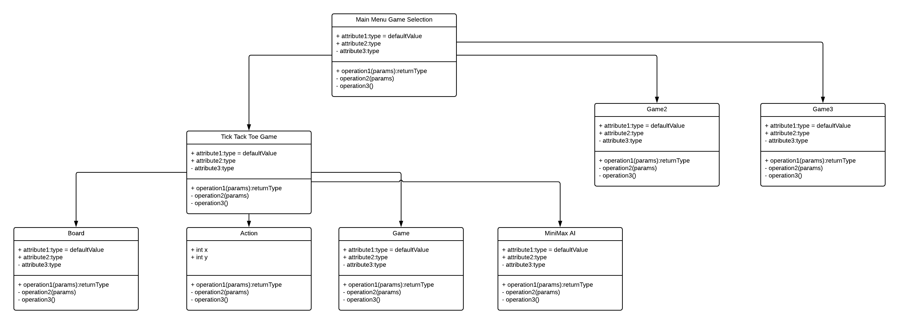

# GameProject
A basic game that has miniGames for the users to choose from.

# Class Diagram UML

# Games 
# Tick Tac Toe
Basic Tick Tac toe game that allows players to choose from a Player VS Player mode and a Player Vs AI, The AI is going to be made with the MiniMax Algorithm
